```
 ▄▄▄        ▄████ ▓█████  ███▄    █ ▄▄▄█████▓ ██▓  ▄▄▄        ▄████ ▓█████  ███▄    █  ▄████▄ ▓██   ██▓
▒████▄     ██▒ ▀█▒▓█   ▀  ██ ▀█   █ ▓  ██▒ ▓▒▓██▒ ▒████▄     ██▒ ▀█▒▓█   ▀  ██ ▀█   █ ▒██▀ ▀█  ▒██  ██▒
▒██  ▀█▄  ▒██░▄▄▄░▒███   ▓██  ▀█ ██▒▒ ▓██░ ▒░▒██▒ ▒██  ▀█▄  ▒██░▄▄▄░▒███   ▓██  ▀█ ██▒▒▓█    ▄  ▒██ ██░
░██▄▄▄▄██ ░▓█  ██▓▒▓█  ▄ ▓██▒  ▐▌██▒░ ▓██▓ ░ ░██░ ░██▄▄▄▄██ ░▓█  ██▓▒▓█  ▄ ▓██▒  ▐▌██▒▒▓▓▄ ▄██▒ ░ ▐██▓░
 ▓█   ▓██▒░▒▓███▀▒░▒████▒▒██░   ▓██░  ▒██▒ ░ ░██░  ▓█   ▓██▒░▒▓███▀▒░▒████▒▒██░   ▓██░▒ ▓███▀ ░ ░ ██▒▓░
```

<div align="center">

**building the nervous system of the agentic internet**

[](https://github.com/agentiagency)

</div>

---

## what we're building

a fully integrated autonomous agentic OS. not a wrapper. not a chatbot platform. the infrastructure layer that makes persistent, capable, policy-governed AI agents real.

**policy engine → capability network → human/AI pairing**
agents that know what they're allowed to do, can acquire new capabilities, and grow alongside the humans they're paired with.

---

## the stack

| project | what it is | status |
|---------|-----------|--------|
| [**agentimolt**](https://github.com/agentiagency/agentimolt-v03) | AI agent platform — users get their own persistent agents (molts) | 🟢 active |
| [**agentisecure**](https://github.com/agentiagency/agentisecure) | monotonically narrowing policy engine + federation trust graph | 🟢 active |
| [**agentisync**](https://github.com/agentiagency/agentisync) | capability distribution network — skills and tools for agents | 🟢 active |
| [**agentiprotect**](https://github.com/agentiagency/agentiprotect) | LLM security proxy layer | 🟢 active |
| [**agenticlaw**](https://github.com/agentiagency/agenticlaw) | Rust-based agent runtime, systemd daemon tier | 🔨 building |

---

## the architecture

```
┌─────────────────────────────────────────────────────┐
│                   agentimolt                        │
│         (persistent agent platform)                 │
├────────────────┬────────────────┬───────────────────┤
│  agentisecure  │  agentisync    │  agentiprotect    │
│  policy engine │  cap network   │  LLM proxy        │
├────────────────┴────────────────┴───────────────────┤
│                   agenticlaw                        │
│              (Rust agent runtime)                   │
└─────────────────────────────────────────────────────┘
```

policy narrows monotonically. capabilities distribute freely. agents persist across sessions. humans and agents grow together.

---

## why it matters

current AI platforms give you conversations. we give you **agents** — entities with memory, policy constraints, and the ability to acquire new capabilities on demand.

the vision: a social network where the feed doesn't just show you content — it emergently connects you with agents and humans that help you become more yourself.

---

## contribute

we're engineers building something that hasn't existed before. if you think in systems, care about agent autonomy and safety simultaneously, and want your work to matter —

→ explore the repos above
→ open issues, PRs, discussions
→ or just star something and watch where it goes

---

<div align="center">
<sub>AgentiAgency · agents that persist · policies that protect · capabilities that grow</sub>
</div>

<!-- DASHBOARD:START -->
## 📊 repository dashboard

> _last updated: Mon, 02 Mar 2026 14:48:59 GMT_

| repo | 🐛 issues | 🔀 prs | main CI | latest PR CI |
|------|-----------|--------|---------|--------------|
| [**agenticlaw**](https://github.com/agentiagency/agenticlaw) | 34 | 15 | 🟢 `3/3` | ⚪ `0/0` [#25](https://github.com/agentiagency/agenticlaw/pull/25) |

---

## 📈 activity — last 30 days

> bars: **issues created** · **issues closed** · **PRs merged** (by week)

```mermaid
xychart-beta
  title "agenticlaw — last 30d (created / closed / merged)"
  x-axis ["W1", "W2", "W3", "W4"]
  y-axis "count" 0 --> 20
  bar [0, 0, 0, 42]
  bar [0, 0, 0, 8]
  bar [0, 0, 0, 3]
```

<details><summary><strong>agenticlaw</strong></summary>



</details>

<!-- DASHBOARD:END -->
